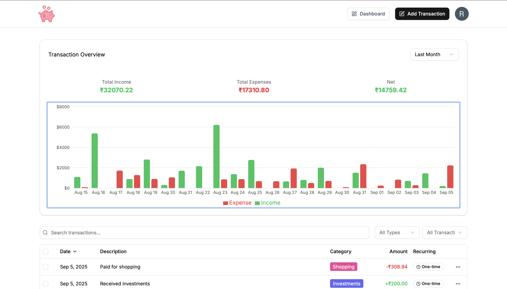
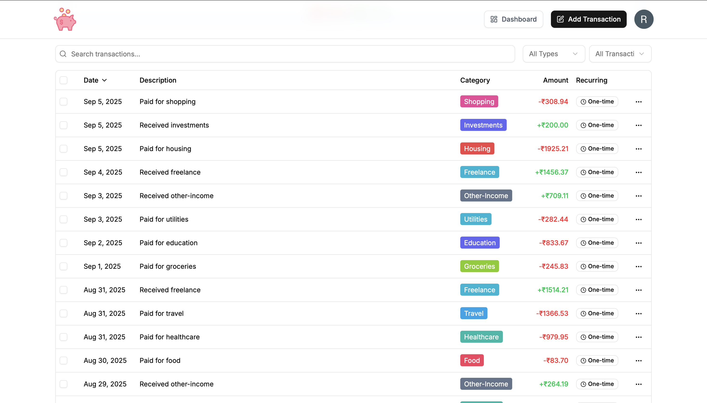
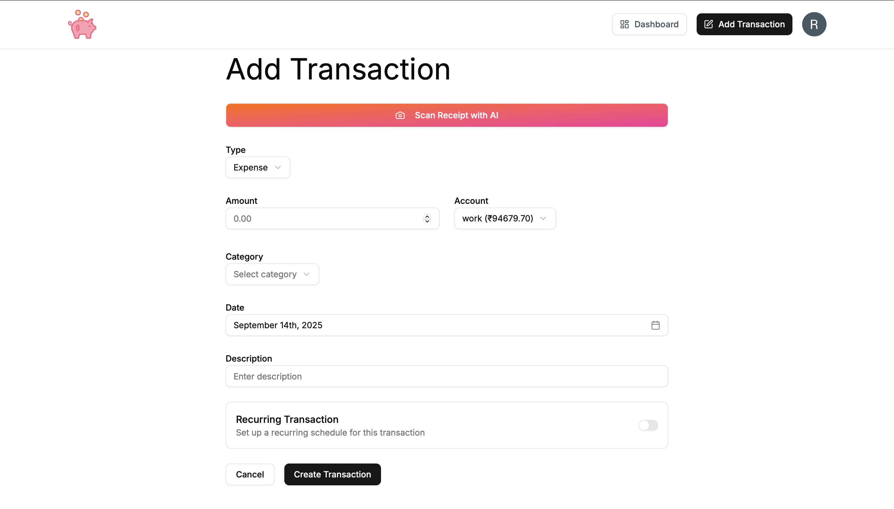

# AI-Finance-App (Cashy)

A smart finance management application powered by AI to help users track, analyze, and optimize their financial decisions.

## Overview

AI-Finance-App offers advanced tools for budgeting, expense tracking, and personalized financial insights. Built with Next.js and Clerk for authentication, it features AI-powered receipt scanning using Gemini 1.5 Flash, and uses Supabase as its database, making money management easier and smarter.

## Features

- **AI-powered receipt scanning:** Quickly add transactions by scanning receipts using Gemini 1.5 Flash.
- **Budget tracking:** Set budgets and monitor your expenses in real-time.
- **Automatic categorization:** Transactions are smartly categorized for clarity.
- **Dashboard analytics:** Visualize financial data with interactive charts and summaries.
- **Secure authentication:** User login and account security powered by Clerk (OAuth).
- **Modern UI:** Responsive and easy-to-use interface.
- **Supabase database:** Fast and scalable backend solution.

## Screenshots

> **Note:** Upload your screenshots to an `assets` folder in your repository, e.g., `assets/image1.png`, `assets/image2.png`, etc.

### Landing Page
  
*Welcome screen introducing the AI-powered platform for managing finances smartly.*

### Dashboard Overview
  
*Graphical analytics of income and expenses with a transaction overview table.*

### Transaction List
  
*Detailed list of transactions, categorized and color-coded for easy tracking.*

### Add Transaction
  
*Intuitive form to add new transactions, including AI-powered receipt scanner.*

## Installation

1. **Clone the repository**
   ```bash
   git clone https://github.com/rashyy17/AI-Finance-App.git
   cd AI-Finance-App
   ```

2. **Install dependencies**
   ```bash
   npm install
   ```

3. **Set up environment variables**  
   Create a `.env.local` file and add your Clerk, Gemini, and Supabase API keys and configuration.

4. **Run the application**
   ```bash
   npm run dev
   ```

## Usage

1. Register or log in with Clerk-powered OAuth.
2. Connect your bank account or manually add expenses.
3. Use the AI receipt scanner for quick transaction entry.
4. Set your budget and track transactions.
5. Explore AI-powered insights and analytics on your dashboard.

## Technologies Used

- **Frontend:** Next.js
- **AI:** Gemini 1.5 Flash (for receipt scanning)
- **Authentication:** Clerk (OAuth)
- **Database:** Supabase
- **Charts:** (e.g. Chart.js, Recharts, etc.)

## Contributing

Contributions are welcome! Please create an issue to discuss ideas or submit a pull request.

## License

This project is licensed under the MIT License.

## Contact

For questions, contact [rashyy17](https://github.com/rashyy17).

---

*Feel free to customize this README with more specific details about your app’s architecture, features, or setup instructions!*
